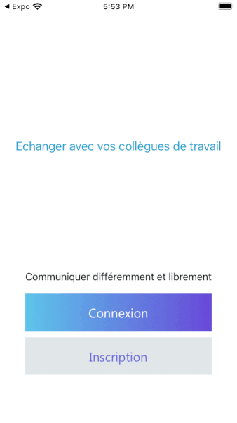

# Getus

Getus is a mobile application to chat with your coworkers
You can speak with your colleagues on the public chat or create private conversations.

Disclaimer: for privacy reasons, the source code of the mobile app cannot be commited.
This project has been realised for one of my customers.

**Context**

This mobile application has been developed for the CEO of a company who wanted a mobile app for his employees.
He wanted them to be able to create public chats for each project (or team) in which they were involved.
He also wanted them to be able to chat privately between eachother.

**Demo**

**How the mobile application works**

- You can create a new account using your phone number
- You then have to choose a project and enter the special password for this project
- You can send messages on the public chat
- You can click on your colleague avatar to open a new private chat
- You can browse the FAQ
- You can invite a colleague by email
- You can report a chat

**How does it work**

The backend is built with firebase and the mobile application uses <a id="raw-url" href="https://github.com/FaridSafi/react-native-gifted-chat">react-native-gifted</a>
